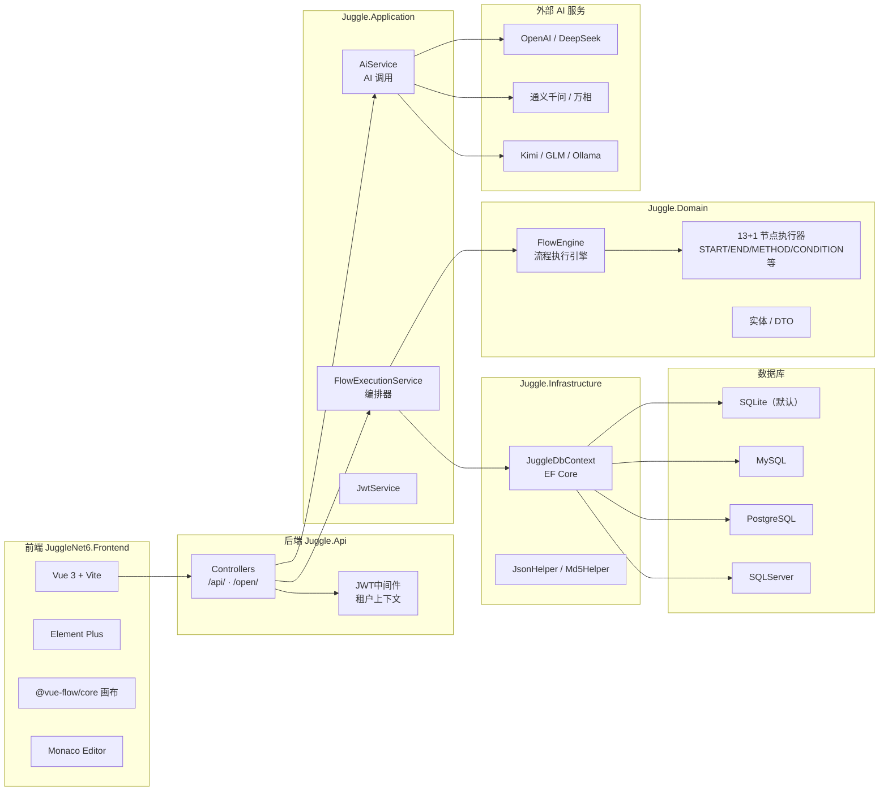

# Juggle — 图形化 API 流程编排平台（AI 驱动）

<div align="center">

**「积木」+「魔法」**——像积木一样灵活，像魔法一样强大，让 AI 替你写接口、跑流程、做报表。

[](./LICENSE)
[](https://dotnet.microsoft.com/download/dotnet/8.0)
[](https://vuejs.org/)
[](https://element-plus.org/)
[](https://github.com/pythonHuang/JuggleNet6/commits/main)
[](https://github.com/pythonHuang/JuggleNet6/pulse)
[](https://github.com/pythonHuang/JuggleNet6/stargazers)
[](https://docs.docker.com/get-started/)
[](https://github.com/pythonHuang/JuggleNet6/actions)
[](#)

👉 **中文** | [English](#-english)

</div>

---

## 📖 简介

Juggle（积木 + 魔法）是一个**可视化 API 流程编排平台**，通过拖拽式画布将多个接口串联成完整业务流程，支持 AI 对话自动生成流程、智能体多轮对话与工具调用、生图/生视频、报表设计等。

后端基于 **.NET 8** + **EF Core 8**，前端 **Vue 3** + **Element Plus** + **@vue-flow/core**，内置 SQLite（可切换 MySQL / PostgreSQL / SQLServer）。系统已稳定运行，提供 Docker 一键部署方案，默认账号 `juggle / juggle`，监听 `9127` 端口。

---

## ✨ 功能特性

| 能力 | 说明 |
|---|---|
| 🎨 **图形化流程编排** | 14 种节点：START / END / METHOD / CONDITION / MERGE / ASSIGN / CODE / MYSQL / SUB_FLOW / LOOP / DELAY / PARALLEL / NOTIFY / AI |
| 🤖 **AI 智能编排** | 对话描述需求 → 大模型自动生成完整流程（含入参/出参定义 + 节点连线 + 条件分支），预览确认后入库 |
| 🧠 **AI 智能体对话** | 多轮对话、工具调用（接口直调/流程递归），最多 4 轮；支持生图/生视频模型（通义万相 / OpenAI） |
| 🎛️ **模型助手** | 自定义助手（名称/提示词/输入输出参数），绑定技能/接口/流程/工具能力；支持温度/最大输出/随机种子/深度思考 |
| 🏪 **内置应用市场** | 发现 / 导入 / 收藏 / 下载 / 发布，支持 GitHub PR 分享条目 |
| 📊 **报表设计器** | 数据视图 + 报表设计（行列编辑 / 公式引擎 SUM / IF / 分页预览） |
| 📈 **监控模块** | API 拓扑图（健康检查 / 访问统计 / DB 调用连线）+ 告警规则 + 告警记录 |
| 🔐 **多租户 + JWT 认证** | 严格/宽松双隔离策略，RBAC 角色权限 |
| 🗄️ **多数据库** | 系统库：SQLite / MySQL / PostgreSQL / SQLServer；业务数据源再加 Oracle / 达梦 |

---

## 🏗️ 架构总览



---

## 🚀 快速开始

### Docker 一键启动

```bash
docker run -d \
  --name juggle \
  -p 9127:9127 \
  -v juggle_data:/data \
  pythonhuang/juggle-net8:v1.0
```

或使用 docker-compose：

```bash
docker-compose up -d
```

> 访问 http://localhost:9127，默认账号 `juggle` / `juggle`

### 本地开发

```bash
# 后端
cd Juggle.Api && dotnet run

# 前端
cd JuggleNet6.Frontend && npm install && npm run dev

# 生产构建
cd JuggleNet6.Frontend && npm run build  # → Juggle.Api/wwwroot/
```

**构建状态**：`dotnet build` 0 errors · `vue-tsc` 通过

---

## 📸 界面预览

| 流程编排 | AI 智能编排 |
|---|---|
|  | 对话描述需求，AI 自动生成流程节点与连线 |

| 监控仪表盘 | 报表设计器 |
|---|---|
| API 拓扑图 + 告警规则 | 数据视图 + 公式引擎 |

> 📌 更多截图见仓库 [images/](./images/) 目录。

---

## 🛠️ 技术栈

| 层级 | 技术 |
|---|---|
| 后端 | ASP.NET Core 8 · EF Core 8 · Juggle.Api / Application / Domain / Infrastructure 四层 |
| 前端 | Vue 3 · Vite · Element Plus · Pinia · @vue-flow/core · Monaco Editor |
| 数据库 | SQLite（默认）/ MySQL / PostgreSQL / SQLServer · 业务源支持 Oracle / 达梦 |
| 容器 | Docker multi-stage build · GitHub Actions CI/CD |
| 认证 | JWT Bearer · RBAC 角色权限 · 多租户 `HasQueryFilter` |

---

## 🔍 竞品对比

| 项目 | Juggle（本项目） | n8n | Dify | FastGPT / Coze |
|---|---|---|---|---|
| **核心定位** | API 流程编排 + AI 辅助生成 | 工作流自动化 | LLM 应用开发 | RAG / Bot |
| **自研接口** | 套件/接口管理 + 批量导入 + cURL 复制 | 无 | 无 | 无 |
| **SQL/DB节点** | ✅ 内置 MySQL/SQLite/PG/SS | ⚠️ 需要节点 | ❌ | ❌ |
| **SOAP/WSDL** | ✅ 自动生成 + 调用 | ❌ | ❌ | ❌ |
| **多租户** | ✅ JWT Claims 驱动 | ❌ | ❌ | ❌ |
| **私有化部署** | ✅ Docker 一键 | ✅ | ✅ | ❌ |
| **AI 生成流程** | ✅ 对话→完整编排+预览 | ⚠️ 仅部分 | ⚠️ 仅提示词 | ⚠️ 仅提示词 |
| **生图/生视频** | ✅ 对话模型自动切换 | ❌ | ❌ | ✅（平台内）|
| **应用市场** | ✅ 内置 + GitHub PR 分享 | ❌ | ❌ | ❌ |

> **一句话差异**：Juggle 是**面向后端开发者的 API 编排 + AI 自动生成**工具，补齐了 n8n/Dify 在接口管理、SOAP、SQL、多租户、私有化部署方面的空白。

---

## 📋 最近更新（v1.8）

- 🎨 **生图/生视频**：模型名关键词自动识别类型（chat/image/video），通义万相走 DashScope 异步轮询，OpenAI 兼容走 `images/generations`，气泡内渲染图片/视频带下载按钮
- 🤖 **助手模型参数**：温度 / 最大输出 / 随机种子 / 深度思考开关（透传到 API）
- 🎯 **折叠侧边栏**：220px → 64px，子菜单悬停弹出，状态持久化到 localStorage
- 📊 **监控模块**：API 拓扑图 + 告警规则 + 告警记录
- 🛒 **应用市场**：接口/流程/助手/Skills/报表五类条目，GitHub PR 分享机制
- 🧠 **知识库 + Skill**：KB_SEARCH 节点支持 RAG 问答；Skill 管理支持 JSON/markdown 导入

---

## 🤝 参与贡献

欢迎提交 Issue 和 Pull Request！

1. Fork 本仓库
2. 创建特性分支 `git checkout -b feature/xxx`
3. 提交变更 `git commit -m "feat: xxx"`
4. 推送到分支 `git push origin feature/xxx`
5. 开 Pull Request

---

## 📄 许可证

[MIT License](./LICENSE)

---

## 🙏 致谢

本项目基于 [Juggle](https://github.com/somta/Juggle)（Java 版）的设计思路与架构进行 .NET 8 重写。

感谢 [@somta](https://github.com/somta) 及原项目团队！

---

<div align="center">

如果觉得这个项目对你有帮助，欢迎 ⭐ **Star** 支持！你的 star 是我持续维护的最大动力 💪

</div>

---

<br>

<div id="english"></div>

# Juggle — Visual API Flow Orchestration Platform (AI-Powered)

**中文** | [English](#-english)

---

## 📖 Overview

Juggle means "building blocks" and "magic" in Chinese — flexible like LEGO, powerful like magic. It's a **visual API flow orchestration platform** that lets you string multiple APIs together via drag-and-drop canvas, with AI-assisted flow generation, agent multi-turn chat, image/video generation, and report design built in.

Built with **.NET 8** + **Vue 3** + **Element Plus**, ships with SQLite out of the box (MySQL / PostgreSQL / SQLServer supported). One-click Docker deployment, default credentials `juggle` / `juggle`, listening on port `9127`.

---

## ✨ Features

| Feature | Description |
|---|---|
| 🎨 **Visual Flow Orchestration** | 14 node types: START / END / METHOD / CONDITION / MERGE / ASSIGN / CODE / MYSQL / SUB_FLOW / LOOP / DELAY / PARALLEL / NOTIFY / AI |
| 🤖 **AI Flow Generation** | Describe requirements in chat → LLM auto-generates complete flow (inputs/outputs + node wiring + conditionals), preview and confirm to save |
| 🧠 **AI Agent Chat** | Multi-turn dialogue with tool calling (direct API / recursive flow), up to 4 rounds; image/video generation model support (Tongyi Wanxiang / OpenAI) |
| 🎛️ **Model Assistants** | Custom assistants with system prompt / I/O params; bind skills/APIs/flows/tools; model params: temperature, max tokens, seed, thinking mode |
| 🏪 **Built-in Marketplace** | Discover / import / favorite / download / publish; share to official GitHub via PR |
| 📊 **Report Designer** | Data views + report builder (row/col editing / formula engine SUM & IF / paginated preview) |
| 📈 **Monitoring** | API topology map (health check / visit stats / DB call edges) + alert rules + alert records |
| 🔐 **Multi-tenant + JWT** | Strict/loose isolation via `HasQueryFilter`, RBAC role permissions |
| 🗄️ **Multi-DB** | System: SQLite / MySQL / PostgreSQL / SQLServer; business sources also support Oracle / Dameng |

---

## 🚀 Quick Start

### Docker One-Click

```bash
docker run -d \
  --name juggle \
  -p 9127:9127 \
  -v juggle_data:/data \
  pythonhuang/juggle-net8:v1.0
```

- Access: http://localhost:9127
- Default: `juggle` / `juggle`

### Local Development

```bash
# Backend
cd Juggle.Api && dotnet run

# Frontend
cd JuggleNet6.Frontend && npm install && npm run dev
```

**Build status**: `dotnet build` 0 errors · `vue-tsc` passes

---

## 🛠️ Tech Stack

| Layer | Tech |
|---|---|
| Backend | ASP.NET Core 8 · EF Core 8 · 4-layer DDD |
| Frontend | Vue 3 · Vite · Element Plus · Pinia · @vue-flow/core · Monaco Editor |
| Database | SQLite (default) / MySQL / PostgreSQL / SQLServer · Oracle / Dameng for business |
| Container | Docker multi-stage · GitHub Actions CI/CD |
| Auth | JWT Bearer · RBAC · Multi-tenant `HasQueryFilter` |

---

## 🔍 vs Competitors

| | Juggle | n8n | Dify | FastGPT / Coze |
|---|---|---|---|---|
| **Focus** | API orchestration + AI generation | Workflow automation | LLM app dev | RAG / Bot |
| **Self-hosted APIs** | ✅ Suite/API mgmt + bulk import | ❌ | ❌ | ❌ |
| **SQL/DB nodes** | ✅ | ⚠️ | ❌ | ❌ |
| **SOAP/WSDL** | ✅ Auto-gen | ❌ | ❌ | ❌ |
| **Multi-tenant** | ✅ JWT Claims | ❌ | ❌ | ❌ |
| **AI generate flows** | ✅ Full flow + preview | ⚠️ Partial | ⚠️ Prompt only | ⚠️ Prompt only |
| **Image/Video gen** | ✅ Auto-switch by model | ❌ | ❌ | ✅ In-platform |
| **Marketplace** | ✅ + GitHub PR sharing | ❌ | ❌ | ❌ |

> **One-liner**: Juggle fills the gap for **backend devs** who need API management, SOAP, SQL, multi-tenancy, and private deployment — things n8n/Dify don't cover.

---

## 📋 Recent Updates (v1.8)

- 🎨 **Image/Video generation**: Model name keywords auto-detect type (chat/image/video), DashScope async polling for Tongyi Wanxiang, OpenAI `images/generations` for URL/b64_json
- 🤖 **Assistant model params**: Temperature / max tokens / seed / thinking switch forwarded to API
- 🎯 **Collapsible sidebar**: 220px → 64px, hover popup, localStorage persisted
- 📊 **Monitoring module**: API topology + alert rules + alert records
- 🛒 **Marketplace**: 5 entry types, GitHub PR sharing workflow
- 🧠 **Knowledge base + Skills**: KB_SEARCH node for RAG; Skill CRUD with JSON/markdown import

---

## 🤝 Contributing

Issues and PRs welcome!

1. Fork the repo
2. `git checkout -b feature/xxx`
3. `git commit -m "feat: xxx"`
4. `git push origin feature/xxx`
5. Open a Pull Request

---

## 📄 License

[MIT License](./LICENSE)

---

## 🙏 Acknowledgments

This project is a .NET 8 reimplementation of the original [Juggle](https://github.com/somta/Juggle) Java project.

Thanks to [@somta](https://github.com/somta) and the original team!

---

<div align="center">

If you find this project helpful, please give it a ⭐ **Star**! Your support keeps this project going 💪

</div>
